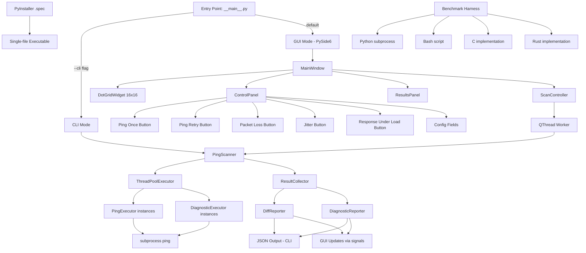

# Design Document: IP Range Ping Diff

## Overview

This tool concurrently pings all hosts (octets 1–254) in two configurable /24 subnets and reports asymmetric reachability — hosts reachable on one subnet but not the other. It uses Python 3.11 with `concurrent.futures.ThreadPoolExecutor` for parallelism and provides two user interfaces:

1. **PySide6 GUI** — A desktop application featuring a 16×16 dot grid visualization (256 dots for octets 0–255), two operation buttons ("Ping Once" and "Ping Retry"), an asymmetric IP list, and scan metrics (runtime, min/median/mode/max delay).
2. **CLI Mode** — A command-line interface that runs the same scan logic and outputs structured JSON (asymmetric IPs + metrics) to stdout.

The scanning logic supports five modes:
1. **Ping Once** — Single attempt per host, no retries.
2. **Ping Retry** — User-specified retry count with a configurable delay between retries.
3. **Packet Loss** — Sends multiple pings (user-configurable count) per host and reports loss percentage.
4. **Jitter** — Sends multiple pings per host and reports min/avg/max/stddev of response times.
5. **Response Under Load** — Sends a rapid burst of pings (user-configurable count and interval) and reports how many were received.

All modes accept user-configurable thread count and timeout parameters. The three advanced diagnostic modes (Packet Loss, Jitter, Response Under Load) take advantage of the single-hop LAN topology to extract richer signal through tuned multi-ping analysis rather than traceroute.

The application is packaged as a single-file executable via PyInstaller with a `.spec` file for reproducible builds. A performance benchmarking harness compares Python subprocess, Bash, C, and Rust ping implementations.

## Architecture



### Design Decisions

1. **`concurrent.futures.ThreadPoolExecutor` over asyncio**: Threads are simpler to integrate with PySide6's Qt event loop. Each ping is a blocking subprocess call; threads allow user-specified parallelism (thread count parameter) and straightforward integration with `QThread` for GUI responsiveness.

2. **Simple retry count (no exponential backoff)**: The requirements specify a user-provided retry count and a configurable delay between retries (in milliseconds). "Ping Once" = 0 retries, "Ping Retry" = N retries with a fixed delay between attempts. Each retry uses the same timeout. The delay defaults to 100ms if not specified — see the Design Notes section below for rationale on meaningful delay values.

3. **PySide6 with QThread for scan execution**: The GUI remains responsive during scans by delegating scan logic to a `QThread` worker. Results are communicated back to the main thread via Qt signals, which trigger dot grid updates and metrics display.

4. **Shared scan engine between GUI and CLI**: The `PingScanner` and `DiffReporter` are GUI-agnostic. The CLI invokes them directly; the GUI wraps them in a `QThread`. This ensures consistent behavior across modes.

5. **16×16 dot grid mapped to octets 0–255**: Dot at position `(row, col)` maps to octet `row * 16 + col`. Octets 0 and 255 are included in the grid display (greyed out if excluded from scan).

6. **PyInstaller single-file bundling**: A `.spec` file declares hidden imports for PySide6 and ensures all resources are included. The spec file is version-controlled for reproducible builds.

## Design Notes: Retry Delay Values

The retry delay parameter controls how long the executor waits between consecutive retry attempts after a failed ping. Choosing a meaningful default and guiding users toward sensible values requires understanding network and process performance characteristics:

- **Local LAN (typical RTT <1ms):** Even a small delay of 50–200ms between retries is more than sufficient for a local host to recover from a transient failure. Shorter delays are unlikely to help — if a host didn't respond within the timeout, it won't respond 1ms later either.

- **ICMP rate-limiting on remote hosts:** Many hosts and firewalls rate-limit ICMP echo replies. When rate-limiting is in effect, hammering retries back-to-back can cause all attempts to be dropped. Longer delays of 500ms–2s give the target time to service the next request.

- **Delay should be at least the expected RTT:** Retrying before a response could even arrive (given network latency) is wasteful. The delay should be at least as long as the typical round-trip time to the target. For same-subnet hosts this is negligible, but for hosts behind WAN links it may be 20–100ms+.

- **Congested networks:** On congested links, overly aggressive retries add traffic that worsens congestion and increases the probability of *all* attempts failing. A delay of at least 200ms helps avoid contributing to congestion collapse.

- **Python subprocess overhead (~5–20ms):** Each ping invocation spawns a subprocess. The overhead of process creation, kernel scheduling, and stdout capture means that delays under ~50ms are dominated by process startup noise and effectively indistinguishable from zero delay. Users should not expect sub-50ms precision from the delay parameter.

- **Performance benchmarking synergy (Req 11):** The benchmarking harness will establish baseline RTT for the target subnets. These measurements can inform the user's choice of retry delay — a good rule of thumb is `retry_delay ≥ 2× median RTT`.

**Default value rationale:** The default of 100ms balances responsiveness (not waiting too long on a LAN) with correctness (long enough to exceed subprocess overhead and allow a brief network recovery window). Users targeting rate-limited hosts should increase this to 500ms–2000ms.

## Design Notes: Why Advanced Diagnostic Modes Over Traceroute

On a single-hop LAN (all hosts directly reachable from the scanning machine via one switch/router hop), `traceroute` provides no additional topology information — every path is just `scanner → switch → host`. The hop count is always 1, and the intermediate node is always the same. There is no multi-hop routing to diagnose.

However, a single-hop topology **does** create opportunities for richer diagnostics through tuned ping patterns:

1. **Packet Loss mode** exploits the fact that on a LAN, any packet loss is a strong signal. Healthy LAN hosts should show 0% loss. Even 1–5% loss indicates a NIC problem, cable issue, or overloaded host — signals that a binary reachable/unreachable check would miss entirely (since the host would still be classified as "reachable" if a single ping succeeds).

2. **Jitter mode** exploits the uniform expected latency of a LAN. On a healthy switched network, RTT should be sub-millisecond with near-zero variance. Elevated jitter (high stddev) indicates CPU saturation on the target host, a congested switch port, or a half-duplex mismatch — none of which traceroute would reveal.

3. **Response Under Load** exploits the ability to send rapid bursts that would be impractical over WAN. On a LAN, the scanner can send pings at 100ms intervals (or faster) without worrying about intermediate router queues. Hosts that drop packets under this modest burst are likely overloaded or have undersized ICMP processing — a valuable diagnostic that differentiates "host is down" from "host is degraded."

These modes collectively transform the tool from a binary reachability checker into a **host health profiler** optimized for LAN environments.

## Components and Interfaces

### Module Structure

```
ip_range_ping_diff/
├── __init__.py
├── __main__.py              # Entry point: --cli flag → CLI, else → GUI
├── scanner.py               # PingScanner orchestration with ThreadPoolExecutor
├── executor.py              # PingExecutor: single-host ping with retry logic
├── diagnostic_executor.py   # DiagnosticExecutor: packet loss, jitter, load modes
├── diff_reporter.py         # DiffReporter: asymmetric diff computation
├── diagnostic_reporter.py   # DiagnosticReporter: format advanced mode results
├── exclusion.py             # ExclusionFilter: octet validation and filtering
├── models.py                # Data models (dataclasses, enums)
├── cli.py                   # CLI argument parsing and JSON output
├── gui/
│   ├── __init__.py
│   ├── main_window.py       # MainWindow: top-level QMainWindow layout
│   ├── dot_grid.py          # DotGridWidget: 16x16 colored dot grid
│   ├── control_panel.py     # ControlPanel: buttons + config fields
│   ├── results_panel.py     # ResultsPanel: asymmetric IP list + metrics
│   └── scan_controller.py   # ScanController: QThread worker + signal bridge
├── config.py                # Default configuration constants
└── benchmark/
    ├── __init__.py
    ├── harness.py            # Benchmark orchestration and reporting
    ├── ping_bash.sh          # Bash ping implementation
    ├── ping_c/
    │   ├── ping_scan.c       # C ping implementation
    │   └── Makefile
    └── ping_rust/
        ├── Cargo.toml
        └── src/
            └── main.rs       # Rust ping implementation
tests/
├── __init__.py
├── test_executor.py
├── test_diagnostic_executor.py
├── test_diff_reporter.py
├── test_diagnostic_reporter.py
├── test_exclusion.py
├── test_scanner.py
├── test_cli.py
├── test_gui/
│   ├── test_dot_grid.py
│   ├── test_scan_controller.py
│   └── test_main_window.py
└── conftest.py              # Shared fixtures and mock helpers
ip_range_ping_diff.spec      # PyInstaller spec file
```

### Component Interfaces

#### PingExecutor (`executor.py`)

```python
class PingExecutor:
    """Executes a single ping with optional retries."""

    def __init__(
        self,
        timeout: float = 1.0,
        retries: int = 0,
        retry_delay_ms: float = 100.0,
    ) -> None:
        """Initialize executor.

        Args:
            timeout: Timeout in seconds for each individual ping attempt.
            retries: Number of retry attempts after initial failure.
                     0 = no retries ("Ping Once" mode).
            retry_delay_ms: Delay in milliseconds between consecutive retry
                            attempts. 0 = no delay. Default 100ms.
        """
        ...

    def ping(self, ip_address: str) -> PingResult:
        """Ping a single IP address with configured retries.

        Returns PingResult with reachability status and timing.
        Classifies as reachable if ANY attempt succeeds.
        Classifies as unreachable only after all attempts exhausted.
        Waits retry_delay_ms between consecutive retry attempts.
        """
        ...

    def _execute_ping(self, ip_address: str) -> tuple[bool, float | None]:
        """Execute a single ping subprocess.

        Returns (success, delay_ms). delay_ms is None if unreachable.
        """
        ...
```

#### PingScanner (`scanner.py`)

```python
class PingScanner:
    """Orchestrates concurrent ping scanning of two subnets."""

    def __init__(
        self,
        subnet_a: str = "192.168.1.0/24",
        subnet_b: str = "192.168.2.0/24",
        excluded_octets: set[int] | None = None,
        thread_count: int = 64,
        timeout: float = 1.0,
        retries: int = 0,
        retry_delay_ms: float = 100.0,
        scan_mode: ScanMode = ScanMode.PING_ONCE,
        ping_count: int = 10,
        burst_count: int = 5,
        burst_interval: float = 0.1,
        on_result: Callable[[PingResult], None] | None = None,
        on_diagnostic_result: Callable[[DiagnosticResult], None] | None = None,
    ) -> None:
        """Initialize scanner.

        Args:
            subnet_a: First subnet in CIDR /24 notation.
            subnet_b: Second subnet in CIDR /24 notation.
            excluded_octets: Octets to skip in both subnets.
            thread_count: Number of concurrent threads.
            timeout: Per-ping timeout in seconds.
            retries: Number of retries per failed ping (0 = Ping Once mode).
            retry_delay_ms: Delay in milliseconds between retry attempts.
                            0 = no delay. Default 100ms.
            scan_mode: The scan mode to use (PING_ONCE, PING_RETRY,
                       PACKET_LOSS, JITTER, RESPONSE_UNDER_LOAD).
            ping_count: Number of pings per host for Packet Loss and Jitter modes.
            burst_count: Number of pings in the burst for Response Under Load mode.
            burst_interval: Interval in seconds between burst pings for
                            Response Under Load mode.
            on_result: Optional callback invoked for each completed ping
                       (Ping Once / Ping Retry modes).
            on_diagnostic_result: Optional callback invoked for each completed
                                  diagnostic scan (advanced modes).

        Raises:
            ValueError: If subnet format is invalid.
        """
        ...

    def scan(self) -> ScanResults:
        """Execute the full scan of both subnets concurrently.

        Returns ScanResults containing all ping results and timing.
        For advanced diagnostic modes, results are in diagnostic_results.
        """
        ...

    def _validate_subnet(self, subnet: str) -> str:
        """Validate /24 CIDR format. Returns the subnet prefix (first 3 octets)."""
        ...

    def _generate_hosts(self, prefix: str, octets: list[int]) -> list[str]:
        """Generate full IP addresses from prefix and host octets."""
        ...
```

#### DiagnosticExecutor (`diagnostic_executor.py`)

```python
class DiagnosticExecutor:
    """Executes advanced diagnostic ping modes for a single host."""

    def __init__(
        self,
        timeout: float = 1.0,
        ping_count: int = 10,
        burst_count: int = 5,
        burst_interval: float = 0.1,
    ) -> None:
        """Initialize diagnostic executor.

        Args:
            timeout: Timeout in seconds for each individual ping attempt.
            ping_count: Number of pings for Packet Loss and Jitter modes.
            burst_count: Number of pings in the burst for Response Under
                         Load mode.
            burst_interval: Interval in seconds between consecutive burst
                            pings for Response Under Load mode.
        """
        ...

    def packet_loss(self, ip_address: str) -> PacketLossResult:
        """Send ping_count pings and compute packet loss percentage.

        Returns PacketLossResult with loss_percent (0.0–100.0),
        sent count, and received count.
        """
        ...

    def jitter(self, ip_address: str) -> JitterResult:
        """Send ping_count pings and compute response time statistics.

        Returns JitterResult with min_ms, avg_ms, max_ms, stddev_ms.
        stddev_ms is None if fewer than 2 successful responses.
        """
        ...

    def response_under_load(self, ip_address: str) -> LoadResult:
        """Send burst_count pings at burst_interval spacing.

        Returns LoadResult with sent count, received count, and
        classification (DOWN, DEGRADED, HEALTHY).
        """
        ...

    def _execute_ping(self, ip_address: str) -> tuple[bool, float | None]:
        """Execute a single ping subprocess.

        Returns (success, delay_ms). delay_ms is None if unreachable.
        """
        ...
```

#### DiffReporter (`diff_reporter.py`)

```python
class DiffReporter:
    """Computes asymmetric reachability between two subnet scan results."""

    def compute_diff(
        self,
        results_a: dict[int, PingResult],
        results_b: dict[int, PingResult],
    ) -> AsymmetricDiff:
        """Compute asymmetric differences between two subnet results.

        Returns AsymmetricDiff containing hosts reachable on one subnet only.
        """
        ...

    def format_report(self, diff: AsymmetricDiff, stats: ScanStats) -> str:
        """Format the diff as a human-readable report string."""
        ...

    def to_json(self, diff: AsymmetricDiff, stats: ScanStats) -> str:
        """Serialize diff and stats to a JSON string for CLI output."""
        ...
```

#### ExclusionFilter (`exclusion.py`)

```python
class ExclusionFilter:
    """Filters host octets from scan based on exclusion list."""

    def __init__(self, excluded_octets: set[int]) -> None:
        """Initialize with a set of octets to exclude.

        Raises:
            ValueError: If any octet is outside 0–255.
        """
        ...

    def filter_octets(self, octets: range) -> list[int]:
        """Return octets not in the exclusion set."""
        ...

    def is_excluded(self, octet: int) -> bool:
        """Check if a specific octet is excluded."""
        ...
```

#### DiagnosticReporter (`diagnostic_reporter.py`)

```python
class DiagnosticReporter:
    """Formats and serializes advanced diagnostic scan results."""

    def format_packet_loss_report(
        self, results: dict[int, PacketLossResult], subnet: str
    ) -> str:
        """Format packet loss results as a human-readable table."""
        ...

    def format_jitter_report(
        self, results: dict[int, JitterResult], subnet: str
    ) -> str:
        """Format jitter results as a human-readable table."""
        ...

    def format_load_report(
        self, results: dict[int, LoadResult], subnet: str
    ) -> str:
        """Format response-under-load results as a human-readable table."""
        ...

    def to_json(
        self,
        results: dict[int, DiagnosticResult],
        mode: ScanMode,
        subnet: str,
        stats: ScanStats,
    ) -> str:
        """Serialize diagnostic results to a JSON string for CLI output."""
        ...
```

#### GUI Components

##### DotGridWidget (`gui/dot_grid.py`)

```python
class DotGridWidget(QWidget):
    """16x16 dot grid visualization of host reachability."""

    def __init__(self, parent: QWidget | None = None) -> None:
        """Initialize grid with all dots in NOT_SCANNED state (grey)."""
        ...

    def update_dot(self, octet: int, status: DotStatus) -> None:
        """Update the color of a single dot by octet number.

        Args:
            octet: Host octet (0–255), mapped to grid position (row, col).
            status: The new DotStatus determining color.
        """
        ...

    def reset(self) -> None:
        """Reset all dots to NOT_SCANNED (grey)."""
        ...

    def paintEvent(self, event: QPaintEvent) -> None:
        """Render the 16x16 grid of colored dots."""
        ...
```

##### ScanController (`gui/scan_controller.py`)

```python
class ScanController(QObject):
    """Bridges GUI thread with background scan execution."""

    result_received = Signal(object)  # PingResult
    diagnostic_result_received = Signal(object)  # DiagnosticResult
    scan_completed = Signal(object)   # ScanResults
    scan_error = Signal(str)          # Error message

    def start_scan(
        self,
        subnet_a: str,
        subnet_b: str,
        excluded_octets: set[int],
        thread_count: int,
        timeout: float,
        retries: int,
        retry_delay_ms: float = 100.0,
        scan_mode: ScanMode = ScanMode.PING_ONCE,
        ping_count: int = 10,
        burst_count: int = 5,
        burst_interval: float = 0.1,
    ) -> None:
        """Launch scan on a background QThread.

        Args:
            scan_mode: Determines which scan logic to use.
            ping_count: Number of pings for Packet Loss / Jitter modes.
            burst_count: Number of pings for Response Under Load mode.
            burst_interval: Interval between burst pings in seconds.
        """
        ...

    def is_running(self) -> bool:
        """Return True if a scan is currently in progress."""
        ...
```

##### MainWindow (`gui/main_window.py`)

```python
class MainWindow(QMainWindow):
    """Primary application window."""

    def __init__(self) -> None:
        """Initialize window with dot grid, control panel, and results panel."""
        ...

    def _on_ping_once(self) -> None:
        """Handle Ping Once button click."""
        ...

    def _on_ping_retry(self) -> None:
        """Handle Ping Retry button click."""
        ...

    def _on_packet_loss(self) -> None:
        """Handle Packet Loss button click."""
        ...

    def _on_jitter(self) -> None:
        """Handle Jitter button click."""
        ...

    def _on_response_under_load(self) -> None:
        """Handle Response Under Load button click."""
        ...

    def _on_result_received(self, result: PingResult) -> None:
        """Update dot grid and metrics as results arrive."""
        ...

    def _on_diagnostic_result_received(self, result: DiagnosticResult) -> None:
        """Update dot grid with diagnostic coloring as results arrive."""
        ...

    def _on_scan_completed(self, results: ScanResults) -> None:
        """Display final asymmetric IP list and metrics."""
        ...

    def _set_buttons_enabled(self, enabled: bool) -> None:
        """Enable or disable all scan buttons."""
        ...
```

#### CLI (`cli.py`)

```python
def parse_cli_args(argv: list[str] | None = None) -> CLIConfig:
    """Parse command-line arguments for CLI mode.

    Supports modes: ping-once, ping-retry, packet-loss, jitter, load.
    Mode-specific arguments:
      --mode packet-loss: --ping-count (default 10)
      --mode jitter: --ping-count (default 10)
      --mode load: --burst-count (default 5), --burst-interval (default 0.1)

    Args:
        argv: Argument list (defaults to sys.argv[1:]).

    Returns:
        CLIConfig with parsed parameters.

    Raises:
        SystemExit: If invalid arguments (argparse handles error + exit).
    """
    ...

def run_cli(config: CLIConfig) -> None:
    """Execute scan in CLI mode and output JSON to stdout.

    For advanced modes, outputs per-host diagnostic results.
    """
    ...
```

## Data Models

```python
from dataclasses import dataclass, field
from enum import Enum
from typing import Union


class ScanMode(Enum):
    """Available scan modes."""
    PING_ONCE = "ping-once"
    PING_RETRY = "ping-retry"
    PACKET_LOSS = "packet-loss"
    JITTER = "jitter"
    RESPONSE_UNDER_LOAD = "load"


class ReachabilityStatus(Enum):
    """Host reachability classification."""
    REACHABLE = "reachable"
    UNREACHABLE = "unreachable"


class LoadClassification(Enum):
    """Host classification for Response Under Load mode."""
    DOWN = "down"             # 0 responses received
    DEGRADED = "degraded"     # >0 but less than burst_count responses
    HEALTHY = "healthy"       # All burst pings received


class DotStatus(Enum):
    """Visual status for a dot in the grid."""
    NOT_SCANNED = "grey"          # Not yet scanned
    REACHABLE_BOTH = "green"      # Reachable on both subnets
    ASYMMETRIC = "red"            # Reachable on one subnet only
    UNREACHABLE_BOTH = "white"    # Unreachable on both subnets
    # Packet Loss gradient coloring
    LOSS_NONE = "green"           # 0% packet loss
    LOSS_LOW = "yellow"           # 1–49% packet loss
    LOSS_HIGH = "red"             # 50–99% packet loss
    LOSS_TOTAL = "white"          # 100% packet loss (host down)


@dataclass(frozen=True)
class PingResult:
    """Result of pinging a single IP address."""
    ip_address: str
    octet: int
    subnet: str
    status: ReachabilityStatus
    attempts: int          # Total number of ping attempts made
    delay_ms: float | None  # Response time in ms (None if unreachable)


@dataclass(frozen=True)
class PacketLossResult:
    """Result of a Packet Loss diagnostic scan for a single host."""
    ip_address: str
    octet: int
    subnet: str
    sent: int              # Number of pings sent
    received: int          # Number of replies received
    loss_percent: float    # Packet loss percentage (0.0–100.0)


@dataclass(frozen=True)
class JitterResult:
    """Result of a Jitter diagnostic scan for a single host."""
    ip_address: str
    octet: int
    subnet: str
    sent: int              # Number of pings sent
    received: int          # Number of replies received
    min_ms: float | None   # Minimum response time (None if <1 response)
    avg_ms: float | None   # Average response time (None if <1 response)
    max_ms: float | None   # Maximum response time (None if <1 response)
    stddev_ms: float | None  # Std deviation (None if <2 responses)


@dataclass(frozen=True)
class LoadResult:
    """Result of a Response Under Load scan for a single host."""
    ip_address: str
    octet: int
    subnet: str
    burst_sent: int        # Number of burst pings sent
    burst_received: int    # Number of replies received
    burst_interval: float  # Interval used between burst pings (seconds)
    classification: LoadClassification  # DOWN, DEGRADED, or HEALTHY


# Union type for all diagnostic results
DiagnosticResult = Union[PacketLossResult, JitterResult, LoadResult]


@dataclass(frozen=True)
class DiffEntry:
    """A single asymmetric reachability entry."""
    octet: int
    reachable_ip: str
    unreachable_ip: str
    reachable_subnet: str
    unreachable_subnet: str


@dataclass
class AsymmetricDiff:
    """Complete asymmetric reachability report."""
    only_in_a: list[DiffEntry] = field(default_factory=list)
    only_in_b: list[DiffEntry] = field(default_factory=list)

    @property
    def total_differences(self) -> int:
        return len(self.only_in_a) + len(self.only_in_b)

    @property
    def has_differences(self) -> bool:
        return self.total_differences > 0


@dataclass
class ScanStats:
    """Statistics about the completed scan."""
    total_hosts_scanned: int
    hosts_reachable_a: int
    hosts_reachable_b: int
    hosts_unreachable_a: int
    hosts_unreachable_b: int
    asymmetric_count: int
    duration_seconds: float
    min_delay_ms: float | None
    median_delay_ms: float | None
    mode_delay_ms: float | None
    max_delay_ms: float | None


@dataclass
class ScanResults:
    """Complete results from scanning both subnets."""
    subnet_a: str
    subnet_b: str
    scan_mode: ScanMode = ScanMode.PING_ONCE
    results_a: dict[int, PingResult] = field(default_factory=dict)
    results_b: dict[int, PingResult] = field(default_factory=dict)
    diagnostic_results_a: dict[int, DiagnosticResult] = field(default_factory=dict)
    diagnostic_results_b: dict[int, DiagnosticResult] = field(default_factory=dict)
    stats: ScanStats | None = None


@dataclass
class CLIConfig:
    """Parsed CLI arguments."""
    subnet_a: str
    subnet_b: str
    excluded_octets: set[int]
    thread_count: int
    timeout: float
    retries: int
    retry_delay_ms: float
    scan_mode: ScanMode = ScanMode.PING_ONCE
    ping_count: int = 10
    burst_count: int = 5
    burst_interval: float = 0.1
```


## Correctness Properties

*A property is a characteristic or behavior that should hold true across all valid executions of a system — essentially, a formal statement about what the system should do. Properties serve as the bridge between human-readable specifications and machine-verifiable correctness guarantees.*

### Property 1: Scan completeness

*For any* set of excluded octets E (where all elements are in 0–255), when the scanner completes, the result set SHALL contain exactly one `PingResult` per non-excluded octet in the range 1–254 per subnet, totaling `2 * (254 - |E ∩ {1..254}|)` results.

**Validates: Requirements 1.1, 1.3**

### Property 2: Attempt count correctness

*For any* retry count R (≥ 0) and any sequence of ping outcomes (success/failure), if the first success occurs at position K (1-indexed), the total number of attempts SHALL equal `min(K, R + 1)`. If no attempt succeeds, exactly `R + 1` attempts SHALL be made. When R = 0 (Ping Once mode), exactly 1 attempt is made regardless of outcome.

**Validates: Requirements 2.1, 2.2, 2.4, 2.5**

### Property 3: Reachability classification correctness

*For any* IP address and any sequence of ping attempt outcomes (a list of booleans representing success/failure for the attempts actually made), the PingExecutor SHALL classify the host as REACHABLE if and only if at least one attempt in the sequence is successful; otherwise it SHALL classify it as UNREACHABLE.

**Validates: Requirements 2.3, 2.5**

### Property 4: Asymmetric diff correctness

*For any* two dictionaries mapping octets to reachability status (representing subnet A and subnet B results), the DiffReporter SHALL produce an `AsymmetricDiff` where `only_in_a` contains exactly those octets where A is REACHABLE and B is UNREACHABLE, and `only_in_b` contains exactly those octets where B is REACHABLE and A is UNREACHABLE.

**Validates: Requirements 3.1, 3.2**

### Property 5: Diff entry contains valid full IP addresses

*For any* DiffEntry produced by the DiffReporter given valid subnet prefixes, `reachable_ip` and `unreachable_ip` SHALL both be valid IPv4 addresses, their last octets SHALL both equal the entry's `octet` field, and each IP SHALL belong to its respective subnet prefix.

**Validates: Requirements 3.4**

### Property 6: Exclusion filter removes all and only specified octets

*For any* set of valid excluded octets E and any input octet range, the filtered output SHALL contain no element that is a member of E, and SHALL contain all elements of the input range that are NOT in E.

**Validates: Requirements 4.1**

### Property 7: Exclusion filter rejects invalid octets

*For any* integer outside the range 0–255, constructing an ExclusionFilter with that value in the exclusion set SHALL raise a ValueError.

**Validates: Requirements 4.4**

### Property 8: Subnet validation rejects invalid formats

*For any* string that does not conform to valid /24 CIDR notation (pattern: `X.X.X.0/24` where X are valid octet values 0–255), constructing a PingScanner with that string as a subnet SHALL raise a ValueError.

**Validates: Requirements 5.2**

### Property 9: Diff-then-format round-trip consistency

*For any* set of ping results for two subnets, computing the asymmetric diff and then formatting it SHALL produce output that contains every asymmetric octet present in the diff and correct summary statistics matching the input data.

**Validates: Requirements 7.6**

### Property 10: Dot status mapping correctness

*For any* pair of reachability statuses (statusA, statusB) for the same octet, the dot status SHALL be: GREEN if both are REACHABLE, RED if exactly one is REACHABLE, WHITE if both are UNREACHABLE. (NOT_SCANNED applies only before results arrive.)

**Validates: Requirements 8.2**

### Property 11: Metrics computation correctness

*For any* non-empty list of ping delay values (floats > 0), the computed metrics SHALL produce the correct minimum, median, mode, and maximum values according to standard statistical definitions.

**Validates: Requirements 8.8**

### Property 12: Exclusion octet string parsing round-trip

*For any* set of valid integers in 0–255, formatting them as a comma-separated string and parsing that string back SHALL produce the original set of integers.

**Validates: Requirements 8.10**

### Property 13: CLI JSON output validity and round-trip

*For any* valid `AsymmetricDiff` and `ScanStats`, serializing them to JSON via `DiffReporter.to_json()` SHALL produce a string that is valid JSON, and deserializing it SHALL recover all asymmetric IP entries and all metric values.

**Validates: Requirements 10.3, 10.4, 10.5**

### Property 14: Retry delay is applied between attempts

*For any* retry count R > 0 and any retry delay D ≥ 0 (in milliseconds), when a ping fails and retries are performed, the elapsed wall-clock time between the end of one failed attempt and the start of the next SHALL be at least D milliseconds (within measurement tolerance). When D = 0, no intentional delay SHALL be introduced between attempts.

**Validates: Requirements 2.7, 2.8**

### Property 15: Packet loss computation correctness

*For any* positive integer `ping_count` and any sequence of `ping_count` boolean outcomes (true = received, false = lost), the computed `loss_percent` SHALL equal `(ping_count - received_count) / ping_count * 100`, and SHALL always be in the range [0.0, 100.0].

**Validates: Requirements 12.1, 12.2**

### Property 16: Jitter statistics computation correctness

*For any* list of 2 or more positive float response times, the computed jitter statistics SHALL satisfy: `min_ms` equals the minimum value, `avg_ms` equals the arithmetic mean, `max_ms` equals the maximum value, and `stddev_ms` equals the population or sample standard deviation of the values. For lists of fewer than 2 values, `stddev_ms` SHALL be None.

**Validates: Requirements 12.3, 12.4, 12.5**

### Property 17: Burst received count correctness

*For any* positive integer `burst_count` and any sequence of `burst_count` boolean outcomes, the computed `burst_received` SHALL equal the count of true values in the outcome sequence, and SHALL satisfy `0 <= burst_received <= burst_count`.

**Validates: Requirements 12.6, 12.7**

### Property 18: Load classification correctness

*For any* pair of integers (burst_sent, burst_received) where `burst_sent > 0` and `0 <= burst_received <= burst_sent`, the classification SHALL be: DOWN if `burst_received == 0`, HEALTHY if `burst_received == burst_sent`, and DEGRADED otherwise.

**Validates: Requirements 12.8**

### Property 19: Diagnostic results JSON serialization round-trip

*For any* valid `DiagnosticResult` (PacketLossResult, JitterResult, or LoadResult) with valid field values, serializing to JSON via `DiagnosticReporter.to_json()` SHALL produce valid JSON, and deserializing it SHALL recover all per-host metrics (loss_percent, jitter stats, or burst counts) with their original values.

**Validates: Requirements 12.12**

### Property 20: Packet loss dot color mapping

*For any* `loss_percent` value in [0.0, 100.0], the dot grid color mapping SHALL produce: green (LOSS_NONE) when `loss_percent == 0`, yellow (LOSS_LOW) when `0 < loss_percent < 50`, red (LOSS_HIGH) when `50 <= loss_percent < 100`, and white (LOSS_TOTAL) when `loss_percent == 100`.

**Validates: Requirements 8.20**

## Error Handling

### Input Validation Errors

| Error Condition | Component | Behavior |
|---|---|---|
| Excluded octet outside 0–255 | ExclusionFilter | Raises `ValueError` with message indicating invalid octet value |
| Invalid subnet CIDR format | PingScanner | Raises `ValueError` with message indicating expected format |
| Non-/24 subnet mask | PingScanner | Raises `ValueError` indicating only /24 subnets are supported |
| Non-integer in exclusion field (GUI) | ControlPanel | Displays inline validation error, prevents scan start |
| Invalid subnet in config field (GUI) | ControlPanel | Displays inline validation error, prevents scan start |
| Invalid CLI arguments | cli.py | Prints error to stderr, exits with non-zero code |
| Ping count ≤ 0 (Packet Loss/Jitter) | DiagnosticExecutor | Raises `ValueError` indicating ping count must be positive |
| Burst count ≤ 0 (Response Under Load) | DiagnosticExecutor | Raises `ValueError` indicating burst count must be positive |
| Burst interval < 0 (Response Under Load) | DiagnosticExecutor | Raises `ValueError` indicating interval must be non-negative |

### Runtime Errors

| Error Condition | Component | Behavior |
|---|---|---|
| Ping subprocess fails to launch | PingExecutor | Counts as a failed attempt, proceeds with retries if available |
| Ping subprocess times out | PingExecutor | Counts as a failed attempt, proceeds with retries if available |
| OS permission error on ping | PingExecutor | Logs warning, classifies host as unreachable after all attempts exhausted |
| KeyboardInterrupt during scan | PingScanner | Cancels pending futures gracefully, reports partial results |
| QThread interrupted | ScanController | Emits scan_error signal, re-enables buttons |

### Error Strategy

- **Fail-fast for configuration errors**: Invalid inputs raise immediately at construction time (PingScanner, ExclusionFilter) or block scan start (GUI validation) before any scanning begins.
- **Resilient to transient failures**: Ping failures are expected and handled via retry logic. No single ping failure terminates the scan.
- **GUI validation prevents bad state**: The GUI validates all inputs inline before enabling scan initiation. Invalid state is communicated via inline error messages adjacent to the offending fields.
- **Partial results on interruption**: If the user interrupts (Ctrl+C in CLI, or closes window during scan), already-completed results are reported rather than discarded.
- **CLI fails loudly**: Invalid arguments produce a clear error on stderr with a non-zero exit code, following Unix conventions.

## Testing Strategy

### Testing Framework

- **pytest** as the test runner
- **hypothesis** for property-based testing (minimum 100 iterations per property)
- **unittest.mock** / **pytest-mock** for mocking subprocess calls
- **pytest-qt** for PySide6 GUI testing (widget interaction and signal verification)

### Dual Testing Approach

#### Property-Based Tests (Hypothesis)

Each correctness property maps to a property-based test with minimum 100 iterations:

| Property | Test Location | Strategy |
|---|---|---|
| 1: Scan completeness | `test_scanner.py` | Generate random exclusion sets, mock pings, verify result count |
| 2: Attempt count | `test_executor.py` | Generate random (retries, outcome_sequence) tuples, verify attempt count |
| 3: Classification correctness | `test_executor.py` | Generate random outcome sequences, verify REACHABLE iff any True |
| 4: Diff correctness | `test_diff_reporter.py` | Generate random result dicts, verify diff contents both directions |
| 5: Diff entry IPs | `test_diff_reporter.py` | Generate random results with valid subnets, verify IP format |
| 6: Exclusion correctness | `test_exclusion.py` | Generate random octet sets and ranges, verify filtering |
| 7: Exclusion validation | `test_exclusion.py` | Generate integers outside 0–255, verify ValueError |
| 8: Subnet validation | `test_scanner.py` | Generate invalid subnet strings, verify ValueError |
| 9: Format consistency | `test_diff_reporter.py` | Generate random results, compute diff + format, verify output |
| 10: Dot status mapping | `test_gui/test_dot_grid.py` | Generate random status pairs, verify DotStatus |
| 11: Metrics computation | `test_scanner.py` | Generate random delay lists, verify min/median/mode/max |
| 12: Exclusion parsing | `test_gui/test_main_window.py` | Generate random octet sets, round-trip through string format |
| 13: CLI JSON round-trip | `test_cli.py` | Generate random diffs + stats, serialize + deserialize, verify |
| 14: Retry delay timing | `test_executor.py` | Generate random (retries, delay_ms) tuples with mocked sleep, verify delay is applied between attempts |
| 15: Packet loss computation | `test_diagnostic_executor.py` | Generate random (ping_count, outcomes) tuples, verify loss_percent formula |
| 16: Jitter statistics | `test_diagnostic_executor.py` | Generate random lists of 2+ floats, verify min/avg/max/stddev match standard definitions |
| 17: Burst received count | `test_diagnostic_executor.py` | Generate random (burst_count, outcomes) tuples, verify received = count of True |
| 18: Load classification | `test_diagnostic_executor.py` | Generate random (sent, received) pairs, verify DOWN/DEGRADED/HEALTHY classification |
| 19: Diagnostic JSON round-trip | `test_diagnostic_reporter.py` | Generate random diagnostic results, serialize + deserialize, verify all fields |
| 20: Packet loss dot color | `test_gui/test_dot_grid.py` | Generate random loss_percent in [0, 100], verify color threshold mapping |

Each test is tagged with: `# Feature: ip-range-ping-diff, Property {N}: {title}`

#### Example-Based Unit Tests

- Default subnet values ("192.168.1.0/24" and "192.168.2.0/24") (5.3)
- Known diff scenario with specific expected output (3.3)
- Button state toggling during scan lifecycle (8.12, 8.13)
- DotGrid initial state — all grey (8.1)
- CLI invocation without --cli flag launches GUI (10.1)
- Invalid CLI arguments produce stderr error (10.6)
- Specific exclusion scenarios: empty set, full set, boundary octets (4.2)
- Packet Loss button exists with correct config fields (8.16)
- Jitter button exists with correct config fields (8.17)
- Response Under Load button exists with correct config fields (8.18)
- Jitter with 0 successful responses returns all None stats (12.5)
- Jitter with 1 successful response returns min/avg/max but None stddev (12.5)
- CLI --mode packet-loss invocation with --ping-count (12.11)
- CLI --mode jitter invocation with --ping-count (12.11)
- CLI --mode load invocation with --burst-count and --burst-interval (12.11)

#### Integration Tests

- Full scan-and-diff pipeline with mocked subprocess (7.4)
- GUI scan lifecycle: press button → dots update → results display (8.4, 8.6, 8.11)
- CLI end-to-end: invoke script → parse JSON output → verify structure (10.1–10.5)
- PyInstaller build produces executable (9.1)
- Packet Loss scan lifecycle: press button → dots show gradient → results panel shows per-host loss (8.19, 8.20)
- Jitter scan lifecycle: press button → results panel shows min/avg/max/stddev per host (8.19)
- Response Under Load scan lifecycle: press button → results panel shows received/sent per host (8.19)
- CLI diagnostic mode end-to-end: invoke with --mode → parse JSON → verify per-host metrics (12.12)

#### Mocking Strategy

- **Ping subprocess**: Mock `subprocess.run` to return configurable return codes (0 = success, non-zero = failure) and stdout with timing information, without actual network calls.
- **Timing**: Use deterministic delay values in mocks to verify metrics computation without real latency.
- **Qt signals**: Use `pytest-qt`'s `qtbot.waitSignal` to verify signal emissions during scan lifecycle.
- **ThreadPoolExecutor**: For scan completeness tests, mock executor to return immediate results.
- **Diagnostic modes**: Mock `subprocess.run` to return sequences of configurable outcomes (success with timing, or failure) for multi-ping modes. Use deterministic timing values to verify jitter/stddev computation.
- **Burst interval timing**: Mock `time.sleep` to verify burst intervals are applied without actually waiting.

### Test Configuration

```python
# hypothesis settings for all property tests
from hypothesis import settings

@settings(max_examples=100)
```

### Coverage Target

All public functions and branches in core modules (`executor.py`, `diagnostic_executor.py`, `diff_reporter.py`, `diagnostic_reporter.py`, `exclusion.py`, `scanner.py`, `cli.py`) and the dot status mapping logic in `gui/dot_grid.py` must be covered by the test suite.
